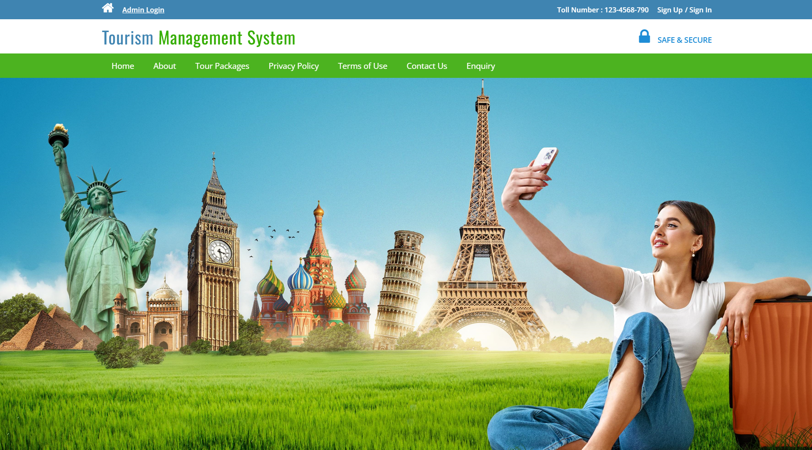
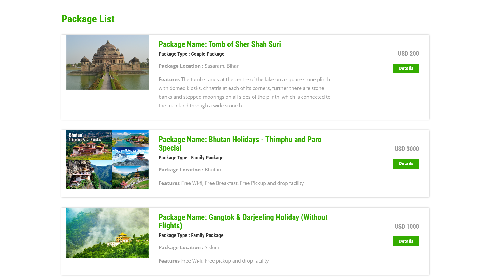
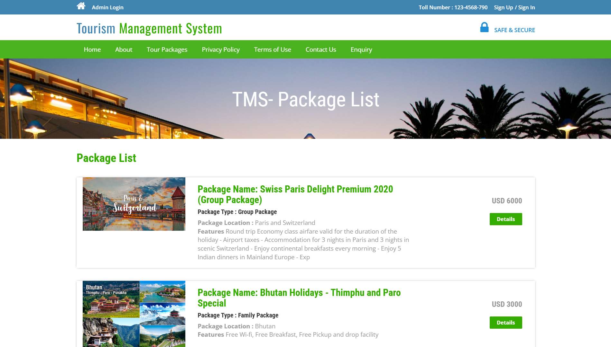
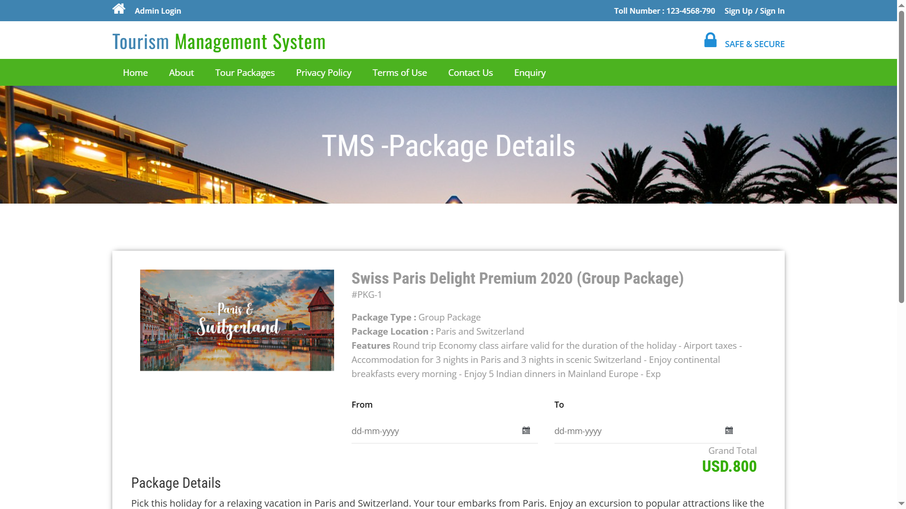
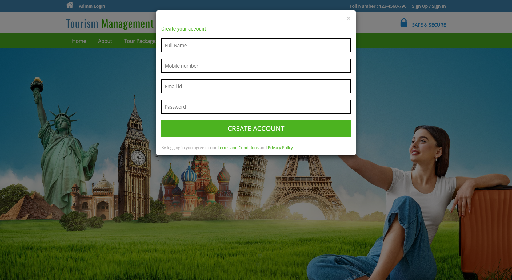
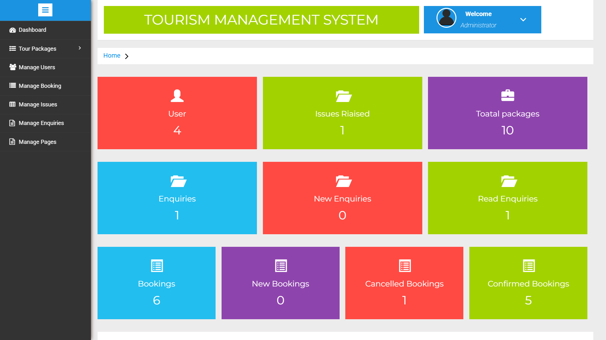
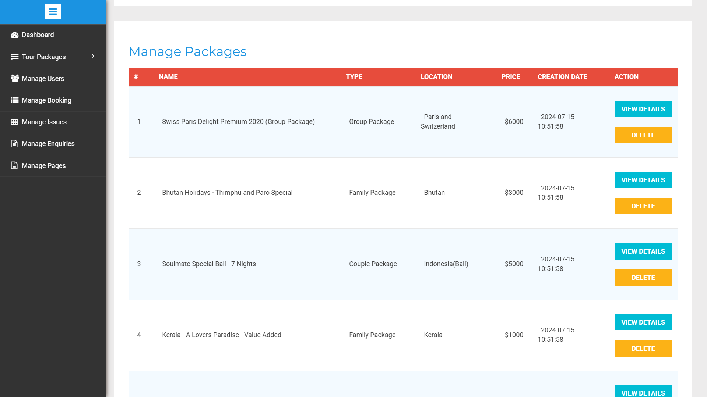
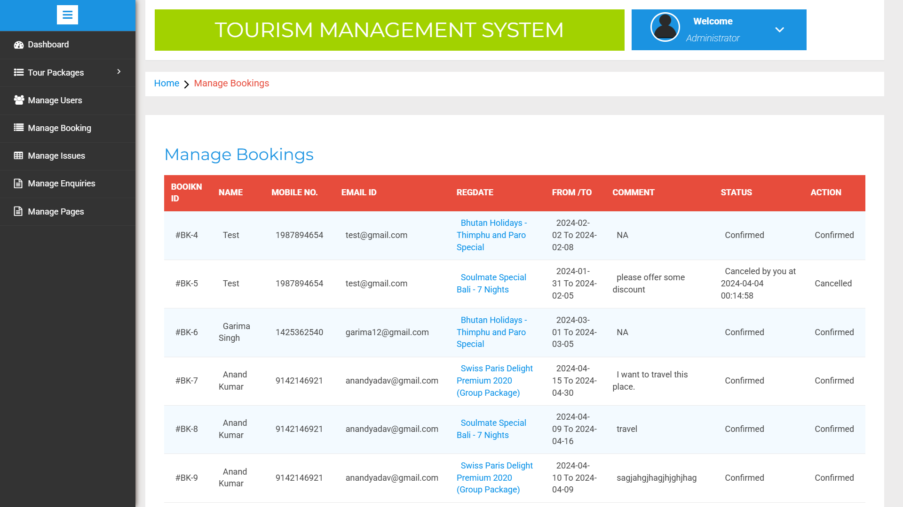

Project: Travel Management System
🔹 Description:
The Travel Management System is a web-based application designed to streamline travel bookings, manage customer data, and facilitate payments for seamless trip planning. It allows users to browse destinations, book trips, and make secure payments online while administrators can manage packages, reservations, and user feedback.

🔹 Key Features:
✅ User Module:

User registration and login
Browse travel packages (hotels, transport, tours)
Online trip booking with real-time availability
Payment gateway integration for secure transactions
Booking history and invoice generation
✅ Admin Module:

Add, update, and delete travel packages
Manage user bookings and confirmations
Generate reports for revenue analysis
User feedback and review management
✅ Other Functionalities:

Responsive design for desktop & mobile
Secure authentication using JWT (if applicable)
Interactive UI with filtering and sorting options
🔹 Technologies Used:

✅ Project Screenshot::

✅Login Details for admin:
Username: admin
Password: Test@123

✅Login Details for user: 
Username: test@gmail.com
Password: Test@123

Frontend: HTML, CSS, JavaScript, Bootstrap
Backend: PHP, Laravel
Database: MySQL
Developer Tools: XAMPP, Git/GitHub, Postman
Version Control: Git
🔹 Impact & Achievements:
🚀 Optimized the booking process, reducing manual efforts by 80%
📈 Improved customer experience with seamless online transactions
🔒 Ensured secure payment processing with encrypted transactions